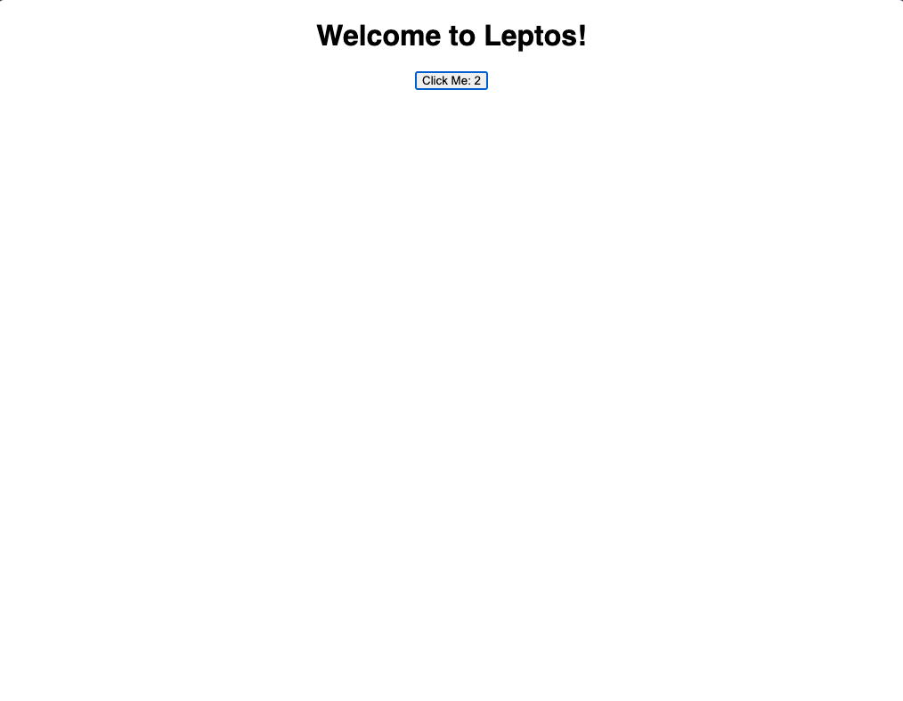

<picture>
    <source srcset="https://raw.githubusercontent.com/leptos-rs/leptos/main/docs/logos/Leptos_logo_Solid_White.svg" media="(prefers-color-scheme: dark)">
    
</picture>

# Leptos Axum Starter Template with WASIX Compilation

This is a template for use with the [Leptos](https://github.com/leptos-rs/leptos) web framework and the [cargo-leptos](https://github.com/akesson/cargo-leptos) tool using [Axum](https://github.com/tokio-rs/axum).

## Creating your template repo

If you don't have `cargo-leptos` installed you can install it with

```bash
cargo install cargo-leptos
```

Then run

```bash
cargo leptos new --git leptos-rs/start-axum
```

to generate a new project template.

```bash
cd {projectname}
```

to go to your newly created project.  
Feel free to explore the project structure, but the best place to start with your application code is in `src/app.rs`.  
Addtionally, Cargo.toml may need updating as new versions of the dependencies are released, especially if things are not working after a `cargo update`.

## Running your project

```bash
cargo leptos watch
```

## Installing Additional Tools

By default, `cargo-leptos` uses `nightly` Rust, `cargo-generate`, and `sass`. If you run into any trouble, you may need to install one or more of these tools.

1. `rustup toolchain install nightly --allow-downgrade` - make sure you have Rust nightly
2. `rustup target add wasm32-unknown-unknown` - add the ability to compile Rust to WebAssembly
3. `cargo install cargo-generate` - install `cargo-generate` binary (should be installed automatically in future)
4. `npm install -g sass` - install `dart-sass` (should be optional in future

## Compiling for Release

```bash
cargo leptos build --release
```

Will generate your server binary in target/server/release and your site package in target/site

## Testing Your Project

```bash
cargo leptos end-to-end
```

```bash
cargo leptos end-to-end --release
```

Cargo-leptos uses Playwright as the end-to-end test tool.  
Tests are located in end2end/tests directory.

## Executing a Server on a Remote Machine Without the Toolchain

After running a `cargo leptos build --release` the minimum files needed are:

1. The server binary located in `target/server/release`
2. The `site` directory and all files within located in `target/site`

Copy these files to your remote server. The directory structure should be:

```text
start-axum
site/
```

Set the following enviornment variables (updating for your project as needed):

```text
LEPTOS_OUTPUT_NAME="start-axum"
LEPTOS_SITE_ROOT="site"
LEPTOS_SITE_PKG_DIR="pkg"
LEPTOS_SITE_ADDR="127.0.0.1:3000"
LEPTOS_RELOAD_PORT="3000"
```

Finally, run the server binary.

## Compiling for WASIX

Once you have a working project, you can compile it for WASIX.

For achieveing this you need to pin some dependencies to specific versions

> Don't do a `cargo clean` as we still need the `site` directory as it is generated by `cargo leptos build` and `wasix` can not generate it.

```toml
[dependencies]
axum = { version = "0.6.16", optional = true }
console_error_panic_hook = "0.1"
console_log = "1"
cfg-if = "1"
leptos = { version = "=0.2.5", default-features = false, features = [
    "serde",
], git = "https://github.com/theduke/leptos.git", branch = "wasix" }
leptos_axum = { version = "1.0.0", optional = true, git = "https://github.com/theduke/leptos.git", branch = "wasix" }
leptos_meta = { version = "=0.2.5", default-features = false, git = "https://github.com/theduke/leptos.git", branch = "wasix" }
leptos_router = { version = "=0.2.5", default-features = false, git = "https://github.com/theduke/leptos.git", branch = "wasix" }
log = "0.4"
serde = { version = "1", features = ["derive"] }
simple_logger = "4"
tower = { version = "0.4.13", optional = true }
tower-http = { version = "0.4", features = ["fs"], optional = true }
wasm-bindgen = "0.2.84"
thiserror = "1.0.38"
tracing = { version = "0.1.37", optional = true }
http = "0.2.8"

tokio = { version = "=1.24.2", features = [
    "full",
], git = "https://github.com/theduke/tokio.git", branch = "wasix-1.24.2-fixed", optional = true }
parking_lot = { version = "=0.12.1", features = ["nightly"] }

[patch.crates-io]
socket2 = { git = "https://github.com/john-sharratt/socket2.git", branch = "v0.4.7", version = "0.4.7" }
libc = { git = "https://github.com/john-sharratt/libc.git" }
tokio = { git = "https://github.com/theduke/tokio.git", branch = "wasix-1.24.2-fixed" }
tokio-util = { version = "=0.7.3", features = [
    "rt",
], git = "https://github.com/theduke/tokio.git", branch = "wasix-1.24.2-fixed" }
syn-rsx = { git = "https://github.com/theduke/syn-rsx.git", branch = "wasix" }
proc-macro-error = { git = "https://github.com/theduke/proc-macro-error", branch = "wasix" }
wasm-bindgen = { git = "https://github.com/syrusakbary/wasm-bindgen", branch = "wasi" }
```

As you see we are using forked versions of a lot of dependencies. These are currently maintained by Wasmer. We hope to get these changes merged upstream soon.

Now you can compile your project with

> An easy experience would be to just make a new `Cargo.toml` fileand place your previous dependencies in it. You can see in our project too, we have a `Cargo.wasix.toml` which is used for compiling for WASIX.

> Note ⚠️: after updating your `Cargo.toml` , don't forget to run `cargo update` to update your `Cargo.lock` file.

```bash copy
$ cargo wasix build -F ssr
...
   Compiling leptos v0.2.5 (https://github.com/theduke/leptos.git?branch=wasix#dfa2e330)
   Compiling leptos_meta v0.2.5 (https://github.com/theduke/leptos.git?branch=wasix#dfa2e330)
   Compiling leptos_router v0.2.5 (https://github.com/theduke/leptos.git?branch=wasix#dfa2e330)
   Compiling leptos_integration_utils v0.2.5 (https://github.com/theduke/leptos.git?branch=wasix#dfa2e330)
   Compiling leptos_axum v1.0.0 (https://github.com/theduke/leptos.git?branch=wasix#dfa2e330)
   Compiling start-axum v0.1.0 (/wasix-tutorials/leptos-starter)
    Finished dev [unoptimized + debuginfo] target(s) in 16.55s
info: Post-processing WebAssembly files
```

You can find your compiled WASM file in `target/wasm32-wasmer-wasi/debug/start-axum.wasm`

## Running on Wasmer

Running this compiled WASM file on Wasmer is pretty easy. You can use the `wasmer` CLI to run it.

> You need to install the latest version of `wasmer` CLI.

```bash copy
$ wasmer --env LEPTOS_OUTPUT_NAME="start-axum" --env LEPTOS_SITE_ROOT="site" --env LEPTOS_SITE_PKG_DIR="pkg" --env LEPTOS_SITE_ADDR="127.0.0.1:3000" /target/wasm32-wasmer-wasi/debug/start-axum.wasm --net --mapdir=/site:[complete path]/leptos-starter/target/site
listening on http://127.0.0.1:3000
```

> Use absolute path for `--mapdir` flag, mapping goes as `--mapdir=<GUEST_DIR:HOST_DIR>`

### Viewing the site

You can now view the site at `http://127.0.0.1:3000` in your browser.


